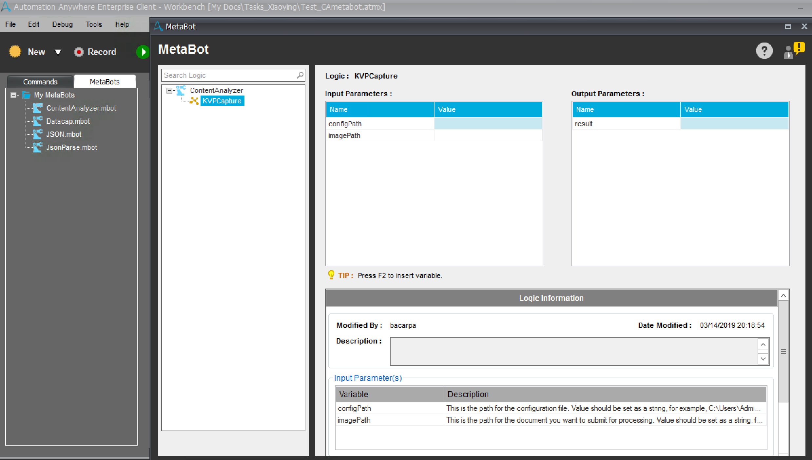

# Content Analyzer MetaBot

This Content Analyzer MetaBot is added to IBM RPA for uploading files, doing classification and extraction and returning key value pairs in JSON via the IBM Business Automation Content Analyzer APIs.

The Content Analyzer Metabot is supported in IBM Robotic Process Automation with Automation Anywhere V11.0

## Basic Components

+ [**ContentAnalyzer.mbot**](ContentAnalyzer.mbot) - The MetaBot to be installed into IBM RPA
+ [**config.json**](config.json) - configuration settings used by Content Analyzer MetaBot

## Prerequisites
At a high level, configuring the Content Analyzer MetaBot requires the following steps:
1. Add the Ontology.
Log into the web interface to “train” your Content Analyzer instance to recognize your specific ontology based on the type of documents to be processed. For example, for invoices, first add document class *Invoice* on Content Analyzer Ontology pageset. Second, add classification world which will be used when doing the document classification. In the third step, add key classes and their key alias which will be extracted in the final JSON output, such as Invoice_Number, Total_Cost, etc. It is recommended to discuss these requirements with the RPA specialist and get a good understanding of how the extracted data will be used later on in the RPA process.

2. Test ontology on the web interface.
After create a new ontology, please go to Documents page on the web interface to upload a file for testing. When the processing is completed, you can check the results by click the file name link. Please verify the document class and key value pairs. If you do not satisfy the results, please correct the key class and click the Learn button. After that resubmit button can trigger a new processing with the revised ontology. When the results are all right, go can start working with Content Analyzer MetaBot.

3. Copy the configuration file.
Please copy the sample configuration file **config.json** to the same system which will install the Content Analyzer MetaBot later.

## Installing and configuring the MetaBot

### Installing the Content Analyzer MetaBot to RPA

**ContentAnalyzer.mbot** is the MetaBot file needed by RPA, please copy ContentAnalyzer.mbot file to the **My MetaBots** folder in your local user repository. The default directory of My MetaBots folder is C:\Users\Administrator\Documents\Automation Anywhere Files\Automation Anywhere\My MetaBots.

### Adding the Configuration Information
Please modify your **config.json** file by adding the following information:

**functionalID and password** - required for authentication. This credential is created in IBM Business Automation Content Analyzer on Cloud user portal or provided by the administrator. Please copy it into configuration file.  
**apiKey** - required for authentication. API Key is generated on Content Analyzer UI, My Activity tab or provided by the administrator.
 
**mainURL** - the URL for making Content Analyzer API calls. Please get request URI from Content Analyzer UI, My Activity tab. For example, https://requesturl/ca/rest/content/v1
 
**fields** - the keys you want to extrac from a document. The keys should be included in the ontology key class. Each key should be a single word.
 
**responseType** and **jsonOptions** do not need to be changed. \
To get a complete sample configuration file, please see the section of Example.

## Setting the Content Analyzer MetaBot and adding it to Task Actions List in RPA

The Content Analyzer MetaBot contains the KVPCapture operation (known as logic in Bot Creator). It requires two input parameters to execute tasks and return the result as a JSON stream.

Input parameters:

Name | Description | Value
--- | --- | --
configFilePath | path for the configuration file |  $configFilePath$ or   string like, C:\config.json 
imagePath | path for the document to process | $imagePath$ or   string like, C:\docs\doc01.pdf 

Output parameter: 

Name | Description | Value
--- | --- | --
results	| JSON output | $results$ 

The values of these parameters could be set either by inserting variables or by entering the real values directly:

1. Add the values of parameters by inserting variables:

First, add three variables to Variable Manager in IBM RPA with the following formats, then insert configFilePath, imagePath into the input parameters, and results into output parameter.
- configFilePath - this is the path for the configuration file. Variable type should be set as Value, variable value should be a string, for example, C:\config.json
- imagePath - this is the path for the electronic or image document you want to process. Variable type should be set as Value, variable value should be a string, for example, C:\docs\doc01.pdf.
- results - variable type should be set ass Value, and variable value should be NULL

2. Add the values of parameters by entering the real values directly:

Of course, the values of input parameters could be added by typing the real values directly in the fields. But the value of output parameter has to be added by inserting a variable which could be a user created variable or a system variable in IBM RPA.

## Example

### Sample config.json
    {
        "functionalID": "ca_api.fid@t01",
        "password": "6haWbPP+jYWa1JdVFpfsncBK6F0gd16CiAYOLxid",
        "apiKey": "123b215d-134a-422e-c652-56c15tt04497",
        "mainURL": "https://requesturl/ca/rest/content/v1",
        "responseType": "\"json\"",
        "jsonOptions": "\"ocr\",\"dc\",\"kvp\",\"sn\"",
        "fields":[
            "Invoice_Number",
            "Total_Cost"	    
        ]
    }

### Sample JSON output
    {
        "Fields": [
            {
                "key": "Invoice_Number",
                "values": [
                    {
                    "value": "Invoice123",
                    "pageNum": 1
                    }
                ]
            },
            {
                "key": "Total_Cost",
                "values": [
                    {
                    "value": "$535.18",
                    "pageNum": 1
                    },
                    {
                    "value": "$482.77",
                    "pageNum": 2
                    }
                ]
            }
        ],
        "Classification": {
            "DocumentClass": "Invoice",
            "ClassMatch": "High",
        }
    }

### Get a property from the JSON output
Content Analyzer MetaBot will return a standard JSON ouput. If you want to get one specific property value from the JSON output, you can use the JSON Metabot embedded in IBM RPA to get the value. For example, you want to get Total_Cost in page number 2 from the JSON stream, then the input parameters of the JSON MetaBot will be:

Parameter | Description | Value
--- | --- | --
json |  A JSON data structure |  Content Analyzer MetaBot JSON output
propertyPath | The path of the property in the JSON data structure you want to retrieve | Fields.[?(@.key=='Total_Cost')].values[?(@.pageNum==2)].value

In this way, you can get the property value of the Total_Cost in page number 2.

For more details about the JSON MetaBot please look at the MetaBot reference in IBM knowledge center https://www.ibm.com/support/knowledgecenter/en/SSMGNY_11.0.0/com.ibm.wbpm.rpa.main.doc/topics/json_metabot.html#json_metabot__get_prop_value

## Related Links
1.  Content Analyzer https://www.ibm.com/support/knowledgecenter/SSUM7G/com.ibm.bacanalyzertoc.doc/bacanalyzer_1.0.html
2. IBM RPA https://www.ibm.com/support/knowledgecenter/en/SSMGNY_11.0.0/com.ibm.wbpm.rpa.main.doc/kc-homepage-rpa.html

## DISCLAIMER OF WARRANTIES
 This code is sample code created by IBM Corporation. IBM grants you a
 nonexclusive copyright license to use this sample code example. This
 sample code is not part of any standard IBM product and is provided to you
 solely for the purpose of assisting you in the development of your
 applications. This example has not been thoroughly tested under all
 conditions. IBM, therefore cannot guarantee nor may you imply reliability,
 serviceability, or function of these programs. The code is provided "AS IS",
 without warranty of any kind. IBM shall not be liable for any damages
 arising out of your or any other parties use of the sample code, even if IBM
 has been advised of the possibility of such damages. If you do not agree with
 these terms, do not use the sample code.

 Copyright IBM Corp. 2019 All Rights Reserved.
